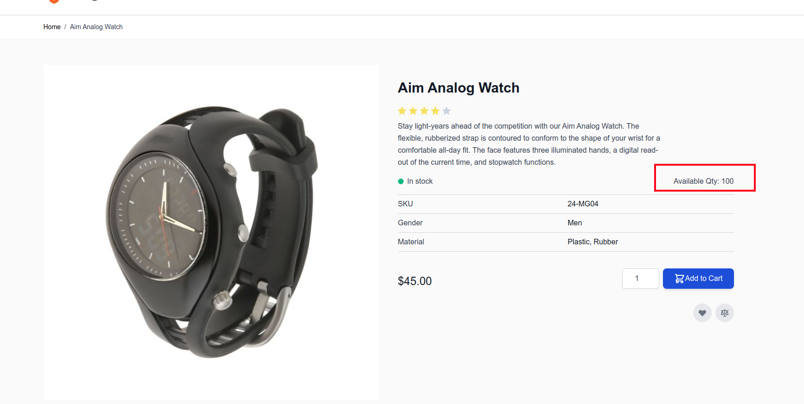

# Hyvä Themes - Product Quantity Updater

[](https://hyva.io/)

## biotec/magento2-product-quantity

This module updates product quantity on product page

Compatible with Magento 2.4.0 and higher.

## Installation

1. Install With Gitlab access:
   ```
   composer config repositories.biotec/magento2-product-quantity git git@github.com:olegpodk/hyva-product-quantity.git
   composer require biotec/module-product-quantity
   ```

2. Enable module
    ```
    bin/magento setup:upgrade
    ```
## Configuration

No configuration needed.

## Expected result
Available quantity should appear and updated automatically without page reloading


